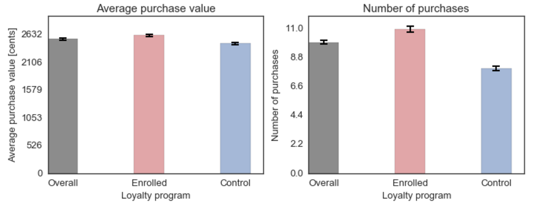
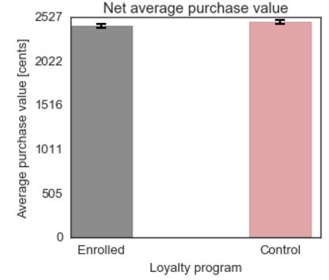
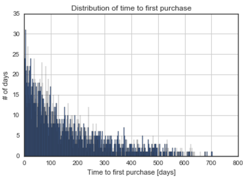
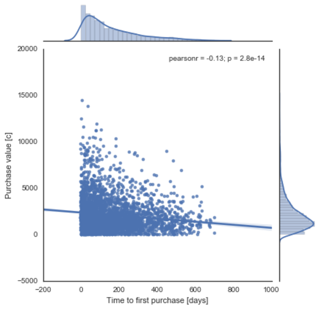

# Investigating customer transactions

## Creating the ETL pipeline

First, my goal was to write a script that extracts the data from the provided CSV files and uploads it to a local database.

__customers.csv__: The customer CSV file provides a list of customer data, where each row represents a unique customer. Each column represents an attribute or value associated with the customer. The columns include:

<code>id</code>: unique user identification number
<code>date</code>: date the user signed up for the service
<code>loyalty</code>: Whether the user is enrolled in the program (enrolled) or part of the control group (control)
<code>location</code>: Location attribute
<code>gender</code>: Gender attribute
<code>age</code>: Age attribute
<code>favorite_movie_line</code>: Favorite movie line of all time
<code>number_of_purchases</code>: Total number of purchases
<code>value_of_purchases</code>: Total value of purchases (in cents)
<code>total_standard_points</code>: Total standard points earned from purchases (if enrolled in loyalty)
<code>total_points_redeemed</code>: Total points redeemed for purchase discount

__transactions.csv__: The transaction CSV file provides a list of all transactions completed over a 2 year time period. Each column represents an attribute or value associated with a transaction.

<code>date</code>: date the transaction was completed
<code>user_id</code>: The id of the user that completed the transaction
<code>value</code>: The value of the transaction (in cents)
<code>point_differential</code>: The difference between points earned and points redeemed (i.e. pointsdifferential = standardpointsearned - pointsredeemed)

With the data loaded into your database, write a script that extracts the data from your local database and aggregates the data so that you can fill in the missing values in the following columns:

number_of_purchases
value_of_purchases
total_standard_points
total_points_redeemed

In this data challenge my goal was to investigate the efficacy of the loyalty program. My insights are described below:

- Customers who are in the loyaty program tend to spend on average more money every time they shop (*t* = 4.85, *p* < 0.001) and they also shop more often. However, the loyalty program also costs money - with every applied discount the company spends 500 cents. It seems reasonable to take that into account and adjust the calculations.

- After adjusting for the cost of the discounts redeemed by the customers the difference in the average purchase value is no longer significant, *t* = -1.67, *p* > 0.05. If I had more time, I would look at the number of purchases - it is possible that since enrolled customers on average shop more often the total net revenue might still be higher.

- Most customers make their first purchase shortly after signing up for the loyalty program. Enrolled customers tend to spend more money on the purchase soon after becoming members, as indicated by a negative correlation *r* = -0.13, *p* < 0.001. The correlation is weak, but highly significant. 

# Requirements:

1. <a href="https://www.python.org/"> Python</a> (2.7)
2. <a href="http://jupyter.org/">Jupyter Notebook</a>
3. <a href="http://www.numpy.org/">NumPy</a>
4. <a href="http://www.scipy.org/">SciPy</a>
5. <a href="http://matplotlib.org/">matplotlib</a>
6. <a href="http://pandas.pydata.org">Pandas</a>
7. <a href="http://scikit-learn.org/stable/">scikit learn</a>
8. <a href="http://seaborn.pydata.org">seaborn</a>
9. <a href="https://www.sqlite.org">SQLite</a>

To install all of them (except Python) using pip run:
<pre>
 pip install -r requirements.txt
</pre>
